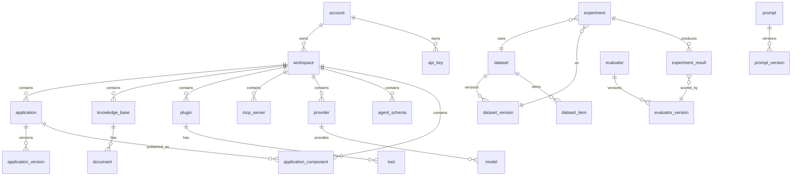

# Spring AI Alibaba 核心数据模型

> 来源：数据库建表 SQL（`spring-ai-alibaba-admin/docker/middleware/init/mysql/`）+ 实体类（`@TableName`/`@Table`）+ 枚举类交叉核对。
> 数据库：MySQL 8（utf8mb4）。按 schema 分块对应 DDL 文件（和你提供的 ER 图对齐）：
>
> | schema | 内容 | 对应 DDL | 表数 | 颜色（ER 图） |
> |--------|------|----------|------|------|
> | `admin` | 平台核心域（账号 / 工作空间 / 应用 / 知识库 / 工具 / 插件 / 模型 / MCP / Agent 等） | `agentscope-schema.sql` | 15 | 蓝色边框 |
> | `agentscope` | 评估实验域 + Prompt 域 + 独立模型配置 | `admin-schema.sql` | 12 | 橙色边框 |
>
> 总计 **2 个 schema、27 张表**。

## 通用约定

| 约定 | 说明 |
|------|------|
| **以 DB 建表 SQL 为准** | 字段以建表 SQL（DDL）为真相之源，entity/DTO 仅作参照。下文每张表的字段表对应 DDL 列，不混入 entity 的非持久化字段或 DTO 字段。entity 与 DDL 的差异见 [附：entity 与 DB 字段差异](#附entity-与-db-字段差异以-db-为准)。 |
| **主键** | 所有表均有自增 `id`（`BIGINT UNSIGNED AUTO_INCREMENT`，起始 10000）。本表主键标 `PK`。 |
| **业务 ID** | 多数表另设字符串业务 ID（如 `app_id`、`kb_id`、`account_id`），带 `UNIQUE` 约束，供外部引用，标 `UK`。 |
| **外键** | 评估域（dataset/evaluator）使用真实 `FOREIGN KEY ... ON DELETE CASCADE`，标 `FK`（DB 约束）。平台域多用"逻辑外键"（仅建索引、无 DB 级约束），以字符串业务 ID 关联，标 `FK*`（逻辑外键，见 [附：隐式逻辑关系](#附隐式逻辑关系无-db-外键靠代码维护)）。 |
| **逻辑删除** | `deleted TINYINT(1)`（0 未删/1 已删）或 `status=0` 表示删除。 |
| **审计字段** | `gmt_create` / `gmt_modified` / `creator` / `modifier`（平台域）；`create_time` / `update_time`（评估域）。 |
| **工作空间隔离** | 平台域资源表普遍带 `workspace_id`，实现多租户隔离。 |
| **entity vs DTO 分离** | entity（持久层映射）见各表下方"实体"标注；DTO（传输层契约）单独见 [附：DTO 清单](#附dto-清单传输层)，二者职责不同，不混述。 |

---

## 目录

- [一、平台核心域](#一平台核心域)
- [二、资源域](#二资源域)
- [三、评估实验域](#三评估实验域)
- [四、Prompt 域](#四prompt-域)
- [五、模型配置域（独立）](#五模型配置域独立)
- [六、枚举值汇总](#六枚举值汇总)
- [七、实体关系（ER 图）](#七实体关系er-图)

---

## 一、平台核心域

### 1. account（账号）

实体：`AccountEntity` → `account`

| 字段 | 类型 | 说明 | 约束/枚举 |
|------|------|------|-----------|
| id | BIGINT(20) UNSIGNED | 自增主键 | PK |
| account_id | VARCHAR(64) | 账号业务 ID | UK |
| username | VARCHAR(255) | 用户名 | |
| email | VARCHAR(255) | 邮箱 | |
| mobile | VARCHAR(255) | 手机号 | |
| password | VARCHAR(255) | 密码（argon2id 哈希） | |
| nickname | VARCHAR(255) | 昵称 | |
| icon | VARCHAR(255) | 头像 | |
| type | VARCHAR(64) | 账号类型 | 枚举：admin / user |
| status | TINYINT(4) | 状态 | 枚举：0 deleted / 1 normal / 2 disabled |
| gmt_create / gmt_modified | DATETIME | 创建/更新时间 | |
| gmt_last_login | DATETIME | 最后登录时间 | |
| creator / modifier | VARCHAR(64) | 创建/修改人 UID | |

### 2. workspace（工作空间）

实体：`WorkspaceEntity` → `workspace`。多租户隔离的顶层容器。

| 字段 | 类型 | 说明 | 约束/枚举 |
|------|------|------|-----------|
| id | BIGINT(20) UNSIGNED | 自增主键 | PK |
| workspace_id | VARCHAR(64) | 工作空间业务 ID | UK |
| account_id | VARCHAR(64) | 归属账号 | FK→account.account_id |
| name | VARCHAR(255) | 名称 | |
| description | VARCHAR(4096) | 描述 | |
| config | TEXT | 工作空间配置 | |
| status | TINYINT(4) | 状态 | 0 deleted / 1 normal |
| gmt_create / gmt_modified | DATETIME | 创建/更新时间 | |
| creator / modifier | VARCHAR(64) | 创建/修改人 | |

### 3. application（应用）

实体：`AppEntity` → `application`。Agent / 工作流应用的元信息。

| 字段 | 类型 | 说明 | 约束/枚举 |
|------|------|------|-----------|
| id | BIGINT UNSIGNED | 自增主键 | PK |
| app_id | VARCHAR(64) | 应用业务 ID | UK |
| workspace_id | VARCHAR(64) | 所属工作空间 | FK→workspace |
| name | VARCHAR(255) | 应用名 | |
| description | VARCHAR(4096) | 描述 | |
| icon | VARCHAR(255) | 图标 | |
| source | VARCHAR(64) | 来源（console 等） | |
| type | VARCHAR(64) | 应用类型 | 枚举：basic / workflow |
| status | TINYINT(4) | 状态 | 枚举：0 deleted / 1 draft / 2 published / 3 published_editing |
| gmt_create / gmt_modified | DATETIME | 创建/更新时间 | |
| creator / modifier | VARCHAR(64) | 创建/修改人 | |

### 4. application_version（应用版本）

实体：`AppVersionEntity` → `application_version`。应用的某个版本快照（config 存放完整 DSL）。

| 字段 | 类型 | 说明 | 约束/枚举 |
|------|------|------|-----------|
| id | BIGINT(20) UNSIGNED | 自增主键 | PK |
| app_id | VARCHAR(64) | 所属应用 | FK→application |
| workspace_id | VARCHAR(64) | 所属工作空间 | FK→workspace |
| version | VARCHAR(32) | 版本号（默认 0.0.1） | 联合索引 |
| config | LONGTEXT | 应用配置（DSL/JSON） | |
| description | VARCHAR(4096) | 版本描述 | |
| status | TINYINT(4) | 状态 | 同 application.status |
| gmt_create / gmt_modified | DATETIME | 创建/更新时间 | |
| creator / modifier | VARCHAR(64) | 创建/修改人 | |

### 5. application_component（应用组件）

实体：`AppComponentEntity` → `application_component`。把应用发布为可复用组件。

| 字段 | 类型 | 说明 | 约束/枚举 |
|------|------|------|-----------|
| id | BIGINT UNSIGNED | 自增主键 | PK |
| code | VARCHAR(64) | 组件 code | |
| workspace_id | VARCHAR(64) | 所属工作空间 | FK→workspace |
| app_id | VARCHAR(64) | 关联应用 | FK→application |
| name | VARCHAR(128) | 组件名 | |
| type | VARCHAR(64) | 类型 | 枚举：agent / workflow |
| config | LONGTEXT | 组件配置 | |
| description | VARCHAR(4096) | 描述 | |
| status | TINYINT | 状态 | 0 deleted / 1 normal / 2 published |
| need_update | TINYINT | 是否需更新 | 0 否 / 1 是 |
| gmt_create / gmt_modified | DATETIME | 创建/更新时间 | |

### 6. agent_schema（Agent 模式定义）

实体：`AgentSchemaEntity` → `agent_schema`。多 Agent 编排的结构化定义。

| 字段 | 类型 | 说明 | 约束/枚举 |
|------|------|------|-----------|
| id | BIGINT(20) UNSIGNED | 自增主键 | PK |
| agent_id | VARCHAR(64) | Agent 业务 ID | UK |
| workspace_id | VARCHAR(64) | 所属工作空间 | FK→workspace |
| name | VARCHAR(255) | 名称 | |
| description | VARCHAR(4096) | 描述 | |
| type | VARCHAR(64) | Agent 类型 | 枚举：ReactAgent / ParallelAgent / SequentialAgent / LLMRoutingAgent / LoopAgent |
| instruction | TEXT | 系统指令 | |
| input_keys | TEXT | 输入键（JSON） | |
| output_key | VARCHAR(255) | 输出键 | |
| handle | LONGTEXT | handle 配置（JSON） | |
| sub_agents | LONGTEXT | 子 Agent 配置（JSON） | |
| yaml_schema | LONGTEXT | 生成的 YAML schema | |
| status | VARCHAR(64) | 状态 | 枚举：DRAFT / PUBLISHED / ARCHIVED（注：实体枚举 AgentStatus 另有 active/inactive/configuring/error） |
| enabled | TINYINT(4) | 启用 | 0 disabled / 1 enabled |
| gmt_create / gmt_modified | DATETIME | 创建/更新时间 | |

### 7. api_key（API 密钥）

实体：`ApiKeyEntity` → `api_key`。

| 字段 | 类型 | 说明 | 约束/枚举 |
|------|------|------|-----------|
| id | BIGINT(20) UNSIGNED | 自增主键 | PK |
| account_id | VARCHAR(64) | 归属账号 | FK→account |
| api_key | VARCHAR(512) | 密钥值 | UK |
| description | VARCHAR(4096) | 描述 | |
| status | TINYINT(4) | 状态 | 0 deleted / 1 normal |
| gmt_create / gmt_modified | DATETIME | 创建/更新时间 | |

### 8. reference（引用关系）

实体：`ReferEntity` → `reference`。通用的"实体 A 引用实体 B"多对多关系表。

| 字段 | 类型 | 说明 | 约束/枚举 |
|------|------|------|-----------|
| id | BIGINT(20) UNSIGNED | 自增主键 | PK |
| main_code | VARCHAR(64) | 主体实体 code | |
| main_type | TINYINT | 主体类型 | 枚举 ReferTypeEnum：2 agent / 3 flow |
| refer_code | VARCHAR(64) | 被引用实体 code | |
| refer_type | TINYINT | 被引用类型 | 枚举 ReferTypeEnum：10 plugin / 20 component_agent / 30 component_workflow |
| workspace_id | VARCHAR(64) | 所属工作空间 | |
| gmt_create / gmt_modified | DATETIME | 创建/更新时间 | |

---

## 二、资源域

### 9. knowledge_base（知识库）

实体：`KnowledgeBaseEntity` → `knowledge_base`。

| 字段 | 类型 | 说明 | 约束/枚举 |
|------|------|------|-----------|
| id | BIGINT(20) UNSIGNED | 自增主键 | PK |
| kb_id | VARCHAR(64) | 知识库业务 ID | UK |
| workspace_id | VARCHAR(64) | 所属工作空间 | FK→workspace |
| name | VARCHAR(255) | 名称 | |
| description | VARCHAR(4096) | 描述 | |
| type | VARCHAR(64) | 类型 | unstructured |
| process_config | TEXT | 处理配置（分块等） | |
| index_config | TEXT | 索引配置 | |
| search_config | TEXT | 检索配置 | |
| total_docs | BIGINT(20) UNSIGNED | 文档总数 | |
| status | TINYINT(4) | 状态 | 0 deleted / 1 normal |
| gmt_create / gmt_modified | DATETIME | 创建/更新时间 | |

### 10. document（文档）

实体：`DocumentEntity` → `document`。

| 字段 | 类型 | 说明 | 约束/枚举 |
|------|------|------|-----------|
| id | BIGINT(20) UNSIGNED | 自增主键 | PK |
| doc_id | VARCHAR(64) | 文档业务 ID | UK |
| workspace_id | VARCHAR(64) | 所属工作空间 | FK→workspace |
| kb_id | VARCHAR(64) | 所属知识库 | FK→knowledge_base |
| name | VARCHAR(255) | 文档名 | |
| type | VARCHAR(64) | 来源类型 | 枚举 DocumentType：file / url / oss |
| format | VARCHAR(64) | 文件格式 | |
| size | BIGINT(20) | 文件大小 | |
| path | VARCHAR(512) | 存储路径 | |
| parsed_path | VARCHAR(512) | 解析后路径 | |
| metadata | TEXT | 元数据 | |
| process_config | TEXT | 分块配置 | |
| source | VARCHAR(255) | 来源 | |
| index_status | TINYINT(4) | 索引状态 | 枚举 DocumentIndexStatus：1 uploaded / 2 processing / 3 processed / 4 failed |
| enabled | TINYINT(4) | 启用 | 0 disabled / 1 enabled |
| status | TINYINT(4) | 删除状态 | 0 deleted / 1 normal |
| error | TEXT | 错误信息 | |
| gmt_create / gmt_modified | DATETIME | 创建/更新时间 | |

### 11. plugin（插件）

实体：`PluginEntity` → `plugin`。

| 字段 | 类型 | 说明 | 约束/枚举 |
|------|------|------|-----------|
| id | BIGINT(20) UNSIGNED | 自增主键 | PK |
| plugin_id | VARCHAR(64) | 插件业务 ID | UK |
| workspace_id | VARCHAR(64) | 所属工作空间 | FK→workspace |
| name | VARCHAR(255) | 名称 | |
| description | VARCHAR(4096) | 描述 | |
| type | VARCHAR(64) | 类型 | 枚举 PluginType：official / custom |
| source | VARCHAR(64) | 来源 | |
| config | TEXT | 插件配置 | |
| status | TINYINT(4) | 状态 | 0 deleted / 1 normal |
| gmt_create / gmt_modified | DATETIME | 创建/更新时间 | |

### 12. tool（工具）

实体：`ToolEntity` → `tool`。

| 字段 | 类型 | 说明 | 约束/枚举 |
|------|------|------|-----------|
| id | BIGINT(20) UNSIGNED | 自增主键 | PK |
| tool_id | VARCHAR(64) | 工具业务 ID | UK |
| workspace_id | VARCHAR(64) | 所属工作空间 | FK→workspace |
| plugin_id | VARCHAR(64) | 所属插件 | FK→plugin |
| name | VARCHAR(255) | 名称 | |
| description | VARCHAR(4096) | 描述 | |
| config | LONGTEXT | 工具配置 | |
| api_schema | LONGTEXT | 工具 API schema | |
| test_status | TINYINT(4) | 测试状态 | 枚举 ToolTestStatus：1 not_test / 2 passed / 3 failed |
| enabled | TINYINT(4) | 启用 | 0 disabled / 1 enabled |
| status | TINYINT(4) | 删除状态 | 0 deleted / 1 normal |
| gmt_create / gmt_modified | DATETIME | 创建/更新时间 | |

### 13. mcp_server（MCP 服务）

实体：`McpServerEntity` → `mcp_server`。

| 字段 | 类型 | 说明 | 约束/枚举 |
|------|------|------|-----------|
| id | BIGINT(20) UNSIGNED | 自增主键 | PK |
| server_code | VARCHAR(64) | 服务 code | |
| workspace_id | VARCHAR(64) | 所属工作空间 | FK→workspace |
| account_id | VARCHAR(64) | 归属账号 | FK→account |
| name | VARCHAR(64) | 名称 | |
| description | VARCHAR(1024) | 描述 | |
| type | VARCHAR(32) | 服务类型 | 枚举 McpServerTypeEnum：OFFICIAL / CUSTOMER |
| install_type | VARCHAR(32) | 安装类型 | 枚举 McpInstallTypeEnum：NPX / UVX / SSE |
| deploy_env | VARCHAR(16) | 部署环境 | local / remote |
| deploy_config | TEXT | 部署配置 | |
| detail_config | TEXT | 详情配置 | |
| host | VARCHAR(1024) | 主机地址 | |
| source | VARCHAR(128) | 来源 | |
| biz_type | VARCHAR(512) | 业务类型 | |
| status | TINYINT | 状态 | 0 unable / 1 normal / 3 deleted |
| gmt_create / gmt_modified | DATETIME | 创建/更新时间 | |

### 14. provider（模型提供商）

实体：`ProviderEntity` → `provider`。

| 字段 | 类型 | 说明 | 约束/枚举 |
|------|------|------|-----------|
| id | BIGINT | 自增主键 | PK |
| workspace_id | VARCHAR(64) | 所属工作空间 | FK→workspace |
| provider | VARCHAR(255) | 提供商标识 | |
| name | VARCHAR(255) | 显示名 | |
| description | VARCHAR(1024) | 描述 | |
| icon | VARCHAR(255) | 图标 | |
| credential | VARCHAR(1024) | 访问凭证（JSON） | |
| supported_model_types | VARCHAR(255) | 支持的模型类型 | |
| protocol | VARCHAR(64) | 协议 | 默认 openai |
| enable | TINYINT(1) | 启用 | 0 disabled / 1 enabled |
| source | VARCHAR(64) | 来源 | preset / custom |
| gmt_create / gmt_modified | DATETIME | 创建/更新时间 | |

### 15. model（模型）

实体：`ModelEntity` → `model`。注意：与 [model_config](#17-model_config模型配置独立) 是两张不同的表。

| 字段 | 类型 | 说明 | 约束/枚举 |
|------|------|------|-----------|
| id | BIGINT | 自增主键 | PK |
| workspace_id | VARCHAR(64) | 所属工作空间 | FK→workspace |
| model_id | VARCHAR(100) | 模型标识 | |
| provider | VARCHAR(100) | 所属提供商 | FK→provider.provider |
| name | VARCHAR(100) | 显示名 | |
| type | VARCHAR(100) | 模型类型 | 枚举：llm / text_embedding / rerank / tts / stt |
| mode | VARCHAR(100) | 模式 | 默认 chat |
| tags | VARCHAR(255) | 标签 | 如 function_call,reasoning,vision |
| icon | VARCHAR(255) | 图标 | |
| enable | TINYINT(1) | 启用 | 0 disabled / 1 enabled |
| source | VARCHAR(100) | 来源 | preset / custom |
| gmt_create / gmt_modified | DATETIME | 创建/更新时间 | |

---

## 三、评估实验域

> 此域使用真实数据库外键 + 逻辑删除（`deleted`）。

### 16. dataset（数据集）

实体：`DatasetDO`（JPA）→ `dataset`。

| 字段 | 类型 | 说明 | 约束/枚举 |
|------|------|------|-----------|
| id | BIGINT(20) UNSIGNED | 自增主键 | PK |
| name | VARCHAR(255) | 数据集名 | |
| description | TEXT | 描述 | |
| columns_config | LONGTEXT | 列结构配置（JSON） | |
| create_time / update_time | DATETIME | 创建/更新时间 | |
| deleted | TINYINT(1) | 逻辑删除 | 0 / 1 |

### 17. dataset_version（数据集版本）

实体：`DatasetVersionDO` → `dataset_version`。

| 字段 | 类型 | 说明 | 约束/枚举 |
|------|------|------|-----------|
| id | BIGINT(20) UNSIGNED | 自增主键 | PK |
| dataset_id | BIGINT(20) UNSIGNED | 所属数据集 | FK→dataset（CASCADE） |
| version | VARCHAR(32) | 版本号 | UK(dataset_id,version) |
| description | TEXT | 描述 | |
| data_count | INT(11) | 该版本数据条数 | |
| status | VARCHAR(32) | 版本状态 | DRAFT / PUBLISHED / ARCHIVED |
| experiments | TEXT | 关联实验（JSON） | |
| dataset_items | TEXT | 数据项集合（JSON） | |
| create_time / update_time | DATETIME | 创建/更新时间 | |

### 18. dataset_item（数据集条目）

实体：`DatasetItemDO` → `dataset_item`。

| 字段 | 类型 | 说明 | 约束/枚举 |
|------|------|------|-----------|
| id | BIGINT(20) UNSIGNED | 自增主键 | PK |
| dataset_id | BIGINT(20) UNSIGNED | 所属数据集 | FK→dataset（CASCADE） |
| columns_config | LONGTEXT | 列结构配置（JSON） | |
| data_content | LONGTEXT | 数据内容（JSON） | |
| create_time / update_time | DATETIME | 创建/更新时间 | |
| deleted | TINYINT(1) | 逻辑删除 | 0 / 1 |

### 19. evaluator（评估器）

实体：`EvaluatorDO` → `evaluator`。

| 字段 | 类型 | 说明 | 约束/枚举 |
|------|------|------|-----------|
| id | BIGINT(20) UNSIGNED | 自增主键 | PK |
| name | VARCHAR(255) | 评估器名 | |
| description | TEXT | 描述 | |
| create_time / update_time | DATETIME | 创建/更新时间 | |
| deleted | TINYINT(1) | 逻辑删除 | 0 / 1 |

### 20. evaluator_version（评估器版本）

实体：`EvaluatorVersionDO` → `evaluator_version`。

| 字段 | 类型 | 说明 | 约束/枚举 |
|------|------|------|-----------|
| id | BIGINT(20) UNSIGNED | 自增主键 | PK |
| evaluator_id | BIGINT(20) UNSIGNED | 所属评估器 | FK→evaluator（CASCADE） |
| version | VARCHAR(32) | 版本号 | UK(evaluator_id,version) |
| description | TEXT | 描述 | |
| model_config | TEXT | 模型配置 | |
| prompt | LONGTEXT | Prompt 配置（JSON） | |
| variables | LONGTEXT | Prompt 变量 | |
| status | VARCHAR(32) | 状态 | DRAFT / PUBLISHED / ARCHIVED |
| experiments | TEXT | 关联实验（JSON） | |
| create_time / update_time | DATETIME | 创建/更新时间 | |

### 21. evaluator_template（评估器模板）

实体：`EvaluatorTemplateDO` → `evaluator_template`。内置评估模板种子数据。

| 字段 | 类型 | 说明 | 约束/枚举 |
|------|------|------|-----------|
| id | BIGINT(20) UNSIGNED | 自增主键 | PK |
| evaluator_template_key | VARCHAR(255) | 模板 key | UK |
| template_desc | VARCHAR(255) | 描述 | |
| template | LONGTEXT | 模板内容 | |
| variables | LONGTEXT | 变量 | |
| model_config | LONGTEXT | 推荐模型参数 | |

### 22. experiment（实验）

实体：`ExperimentDO` → `experiment`。对一次评估运行的描述。

| 字段 | 类型 | 说明 | 约束/枚举 |
|------|------|------|-----------|
| id | BIGINT(20) UNSIGNED | 自增主键 | PK |
| name | VARCHAR(255) | 实验名 | |
| description | TEXT | 描述 | |
| dataset_id | BIGINT(20) UNSIGNED | 数据集 ID | FK→dataset |
| dataset_version_id | BIGINT(20) UNSIGNED | 数据集版本 ID | FK→dataset_version |
| dataset_version | VARCHAR(32) | 数据集版本号 | |
| evaluation_object_config | LONGTEXT | 评估对象配置（JSON） | |
| evaluator_config | TEXT | 评估器配置 | |
| status | VARCHAR(32) | 状态 | 枚举 ExperimentStatus：DRAFT / RUNNING / COMPLETED / FAILED / STOPPED |
| progress | INT(3) | 进度百分比 0–100 | |
| complete_time | DATETIME | 完成时间 | |
| create_time / update_time | DATETIME | 创建/更新时间 | |

### 23. experiment_result（实验结果）

实体：`ExperimentResultDO` → `experiment_result`。每条数据的评估明细。

| 字段 | 类型 | 说明 | 约束/枚举 |
|------|------|------|-----------|
| id | BIGINT(20) UNSIGNED | 自增主键 | PK |
| experiment_id | BIGINT(20) UNSIGNED | 所属实验 | FK→experiment |
| evaluator_version_id | BIGINT(20) UNSIGNED | 评估器版本 | FK→evaluator_version |
| input | LONGTEXT | 输入内容 | |
| actual_output | LONGTEXT | 实际输出 | |
| reference_output | LONGTEXT | 参考输出 | |
| score | DECIMAL(3,2) | 评分 0.00–1.00 | |
| reason | TEXT | 评估理由 | |
| evaluation_time | DATETIME | 评估执行时间 | |
| create_time / update_time | DATETIME | 创建/更新时间 | |

---

## 四、Prompt 域

### 24. prompt（Prompt）

实体：`PromptDO` → `prompt`。

| 字段 | 类型 | 说明 | 约束/枚举 |
|------|------|------|-----------|
| id | BIGINT(20) UNSIGNED | 自增主键 | PK |
| prompt_key | VARCHAR(255) | Prompt 业务 key | UK |
| prompt_desc | VARCHAR(255) | 描述 | |
| latest_version | VARCHAR(32) | 最新版本号 | |
| tags | VARCHAR(255) | 标签 | |
| create_time / update_time | DATETIME(3) | 创建/更新时间 | |

### 25. prompt_version（Prompt 版本）

实体：`PromptVersionDO` → `prompt_version`。

| 字段 | 类型 | 说明 | 约束/枚举 |
|------|------|------|-----------|
| id | BIGINT(20) UNSIGNED | 自增主键 | PK |
| prompt_key | VARCHAR(255) | 所属 Prompt | FK→prompt.prompt_key |
| version | VARCHAR(32) | 版本号 | UK(prompt_key,version) |
| version_desc | VARCHAR(255) | 版本描述 | |
| template | LONGTEXT | 模板内容 | |
| variables | LONGTEXT | 可变参数 | |
| model_config | LONGTEXT | 调试模型参数（JSON） | |
| status | VARCHAR(32) | 版本状态 | pre（预发布）/ release（正式） |
| previous_version | VARCHAR(32) | 前置版本（用于对比） | |
| create_time | DATETIME(3) | 创建时间 | |

### 26. prompt_build_template（Prompt 构建模板）

实体：`PromptTemplateDO` → `prompt_build_template`。内置 Prompt 模板种子数据。

| 字段 | 类型 | 说明 | 约束/枚举 |
|------|------|------|-----------|
| id | BIGINT(20) UNSIGNED | 自增主键 | PK |
| prompt_template_key | VARCHAR(255) | 模板 key | UK |
| tags | VARCHAR(255) | 标签 | |
| template_desc | VARCHAR(255) | 描述 | |
| template | LONGTEXT | 模板内容 | |
| variables | LONGTEXT | 变量 | |
| model_config | LONGTEXT | 推荐模型参数 | |

---

## 五、模型配置域（独立）

### 27. model_config（模型配置）

实体：`ModelConfigDO` → `model_config`。**独立表**，无外键关联其他表，供 Studio 调试/Prompt 运行使用，与 `model` 表（资源域）是两套并存的模型登记。

| 字段 | 类型 | 说明 | 约束/枚举 |
|------|------|------|-----------|
| id | BIGINT | 自增主键 | PK |
| name | VARCHAR(100) | 模型名称 | UK |
| provider | VARCHAR(50) | 提供商 | openai / azure / dashscope 等 |
| model_name | VARCHAR(100) | 模型标识符 | gpt-4 / qwen-max 等 |
| base_url | VARCHAR(500) | 服务地址 | |
| api_key | VARCHAR(500) | API 密钥 | |
| default_parameters | JSON | 默认参数 | |
| supported_parameters | JSON | 支持的参数定义 | |
| status | TINYINT | 状态 | 1 启用 / 0 禁用 |
| create_time / update_time | DATETIME | 创建/更新时间 | |
| deleted | TINYINT(1) | 逻辑删除 | 0 / 1 |

---

## 六、枚举值汇总

| 枚举 | 字段 | 取值 |
|------|------|------|
| AccountType | account.type | admin / user |
| AccountStatus | account.status | 0 deleted / 1 normal / 2 disabled |
| AppType | application.type | basic / workflow |
| AppStatus | application.status / application_version.status | 0 deleted / 1 draft / 2 published / 3 published_editing |
| AppComponentType | application_component.type | agent / workflow |
| AgentType | agent_schema.type | ReactAgent / ParallelAgent / SequentialAgent / LLMRoutingAgent / LoopAgent |
| PluginType | plugin.type | official / custom |
| ToolTestStatus | tool.test_status | 1 not_test / 2 passed / 3 failed |
| DocumentType | document.type | file / url / oss |
| DocumentIndexStatus | document.index_status | 1 uploaded / 2 processing / 3 processed / 4 failed |
| McpServerTypeEnum | mcp_server.type | OFFICIAL / CUSTOMER |
| McpInstallTypeEnum | mcp_server.install_type | NPX / UVX / SSE |
| ModelType | model.type | llm / text_embedding / rerank / tts / stt |
| UploadType | (file) | oss / file |
| CommonStatus | 多表 status | 0 deleted / 1 normal |
| ReferTypeEnum | reference.main_type / refer_type | 2 agent / 3 flow（main）；10 plugin / 20 component_agent / 30 component_workflow（refer） |
| DatasetVersionStatus | dataset_version.status | DRAFT / PUBLISHED / ARCHIVED |
| ExperimentStatus | experiment.status | DRAFT / RUNNING / COMPLETED / FAILED / STOPPED |
| PromptVersionStatus | prompt_version.status | pre / release |

---

## 七、实体关系（ER 图）

### 核心关系说明

**平台核心域**
- `account` 1—N `workspace`（workspace.account_id）
- `account` 1—N `api_key`
- `workspace` 1—N `application` / `knowledge_base` / `plugin` / `mcp_server` / `provider` / `agent_schema` / `application_component`（均带 workspace_id）
- `application` 1—N `application_version`（by app_id）
- `application` 1—N `application_component`（component.app_id，组件化发布）
- `reference`：通用引用关系表，记录 agent/flow 引用 plugin/component 的多对多关系。

**资源域**
- `knowledge_base` 1—N `document`（by kb_id）
- `plugin` 1—N `tool`（by plugin_id）
- `provider` 1—N `model`（by provider + workspace_id）

**评估实验域**
- `dataset` 1—N `dataset_version`（FK CASCADE）
- `dataset` 1—N `dataset_item`（FK CASCADE）。`dataset_version` 与 `dataset_item` 之间**无 DB 列关联**（DDL 无 `dataset_version_id`），见 [附：隐式逻辑关系](#附隐式逻辑关系无-db-外键靠代码维护) 第 1 条。
- `experiment` N—1 `dataset` + N—1 `dataset_version`
- `experiment` 1—N `experiment_result`
- `experiment_result` N—1 `evaluator_version`
- `evaluator` 1—N `evaluator_version`（FK CASCADE）

**Prompt 域**
- `prompt` 1—N `prompt_version`（by prompt_key）

**模型配置域**
- `model_config` 独立，无外键。

### ER 图（SVG）

详见 [docs/data-model-er.svg](data-model-er.svg)。

> 注：`reference`（通用引用）、`evaluator_template`、`prompt_build_template`、`model_config` 为独立/种子表，未画入 ER 图。

---

## 附：entity 与 DB 字段差异（以 DB 为准）

> 排查坑：entity 是持久层映射，DTO 是传输层契约，二者可能含 DDL 没有的字段，或漏映射 DDL 列。本表以建表 SQL（DDL）为真相之源，记录与 entity 的差异。DTO 字段不在此列，见 [附：DTO 清单](#附dto-清单传输层)。

### A. entity 有、DB 无（非持久化字段，不入 DDL）

| 实体 | 字段 | 类型 | 注解 | 说明 |
|------|------|------|------|------|
| `AppEntity` | `latestVersion` | AppVersionEntity | MyBatis-Plus `@TableField(exist = false)` | 应用最新版本快照，查询时拼装，非持久化 |
| `AppEntity` | `publishedVersion` | AppVersionEntity | `@TableField(exist = false)` | 已发布版本快照，查询时拼装 |
| `AccountEntity` | `defaultWorkspaceId` | String | 非持久化 | 当前默认工作空间 ID，运行期赋值，DB 无此列 |

> 注：JPA 的 DO 类（dataset/evaluator/experiment/prompt 等）未发现 `@Transient` 字段。

### B. DB 有、entity 漏映射 / mapper 与 DDL 冲突

| 表 | 问题 | 证据 | 处置 |
|------|------|------|------|
| `dataset_item` | DDL **无** `dataset_version_id` 列，但 `DatasetItemMapper.xml` 的 `selectByDatasetVersionId` 查询在 `WHERE dataset_version_id = #{...}` 引用了该列 | `DatasetItemMapper.xml:80`；对照 `admin-schema.sql` dataset_item DDL 无此列；`DatasetItemDO` 也未映射 | DDL 为准：本表字段表不含 `dataset_version_id`。该查询依赖的列在 DDL 不存在，属代码/DDL 不一致（疑似遗留或运行期动态列），需研发确认 |
| 其余表 | 经核对 entity 与 DDL 列一致 | application/application_version/dataset/knowledge_base/document/mcp_server/agent_schema/model_config | 无差异 |

### C. entity 与 DDL 命名映射（非冲突，仅记录）

平台域 MyBatis-Plus 实体用 `@TableField` 做驼峰→下划线映射（如 `gmtCreate`→`gmt_create`、`appId`→`app_id`、`workspaceId`→`workspace_id`），属正常映射，字段集合一致。评估域 JPA DO 用 `@Column` 同理。

---

## 附：DTO 清单（传输层）

> 排查坑：DTO 与 entity 职责不同——entity 映射 DB 表，DTO 是接口/服务的传输契约（请求/响应/领域传输对象）。DTO 不一定有对应表，字段也可能与表不同（聚合、裁剪、转换）。下面按模块列 DTO 类，**不展开字段**（字段见各 REST 接口文档 [api-list.md](api-list.md)）。

### 1. runtime/domain（平台运行时 DTO，118 个）

| 子包 | 类 |
|------|----|
| 基础 | BaseQuery, Error, PagingList, RequestContext, Result |
| account | Account, ApiKey, ChangePasswordRequest, LoginRequest, Oauth2Type, Oauth2User, RefreshTokenRequest, TokenResponse, Workspace |
| agent | AgentRequest, AgentResponse, AgentStatus |
| app | AgentConfig, AppConfig, AppQuery, Application, ApplicationVersion, FileSearchOptions, KnowledgeBaseQuery |
| audio | AudioOutput, AudioResponseFormat, Voice |
| chat | ChatMessage, ContentType, MessageRole, MultimodalContent, MultimodalContentType, ToolCall, ToolCallType, Usage（+ 反序列化器） |
| component | AppComponent, AppComponentConfig, AppComponentQuery, AppComponentRequest, CustomParam |
| file | File, UploadPolicy, WebUploadPolicy, WebUploadRequest |
| knowledgebase | CreateDocumentRequest, DeleteChunkRequest, DeleteDocumentRequest, Document, DocumentChunk, DocumentQuery, DocumentRetrieverQuery, IndexConfig, IndexDocumentRequest, KnowledgeBase, ProcessConfig, UpdateChunkRequest |
| mcp | Content, McpQuery, McpServerCallToolRequest, McpServerCallToolResponse, McpServerDeployConfig, McpServerDetail, McpServerGetToolsRequest, McpTool, TextContent |
| model | AddModelRequest, AddProviderRequest, CredentialSpec, Model, QueryProviderRequest, UpdateModelRequest, UpdateProviderRequest |
| plugin | Plugin, Tool, ToolExecutionRequest, ToolExecutionResult, ToolQuery |
| refer | Refer |
| tool | ApiParameter, InputSchema, ToolCallSchema |
| workflow | CommonParam, Edge, InvokeSourceEnum, Node, NodeResult, NodeStatusEnum, NodeTypeEnum, ParamSourceEnum, ValueSourceEnum, WorkflowStatus |
| workflow/debug | ApiTaskMsg, ApiTaskRunRequest, AsyncResultRequest, AsyncResultResponse, InitRequest, ProcessGetRequest, ProcessGetResponse, TaskPartGraphRequest, TaskRunParam, WorkflowRequest, WorkflowResponse |

> 注意重名：`Application`/`ApplicationVersion`（app 包）、`Document`/`KnowledgeBase`/`DocumentChunk`（knowledgebase 包）、`Tool`/`Plugin`（plugin 包）、`Account`/`ApiKey`/`Workspace`（account 包）、`Model`（model 包）均为 DTO，与同名 entity（`AppEntity`/`DocumentEntity`/`KnowledgeBaseEntity`/`ToolEntity`/`AccountEntity`/`ModelEntity`…）**不是同一个类**，分属传输层与持久层。

### 2. admin/dto（评估/Prompt/可观测 DTO，84 个）

| 分组 | 类 |
|------|----|
| 会话 | ChatMessage, ChatMessageMetrics, ChatSession |
| 数据集 | Dataset, DatasetColumn, DatasetItem, DatasetVersion |
| 评估 | EvaluationObjectConfig, EvaluationPromptConfig, EvaluationPromptConfigVariableMap, Evaluator, EvaluatorConfig, EvaluatorDebugResult, EvaluatorTemplate, EvaluatorVersion |
| 实验 | Experiment, ExperimentEvaluatorResult, ExperimentEvaluatorResultDetail |
| 工具桩 | MockTool, MockToolDefinition |
| 模型 | ModelConfigInfo, ModelConfigResponse, ModelParameterDef |
| 可观测 | OverviewStatsDTO, ServiceInfoDTO, ServicesResponseDTO, SpanEventDTO, SpanLinkDTO, TraceDetailDTO, TraceSpanDTO |
| Prompt | Prompt, PromptRunResponse, PromptTemplate, PromptTemplateDetail, PromptVersion, PromptVersionDetail, PromptVersionDiffResult (含 VersionMeta {version, status, createTime}, DiffFields {template, variables, modelConfig}, DiffItem {changed, valueA, valueB}) |
| Dashboard / Overview | OverviewResponse (含 OverviewStats {prompts, versions, experiments, datasets, knowledgeBases, models: StatItem}, StatItem {total}, TopPromptVersion {promptKey, preCount, releaseCount}, RecentActivity {type, title, time, description}, DocIndexStatus {kbId, kbName, totalDocs, indexedDocs, progress}) |
| 其他 | VariableMapItem |
| request/* | DataItemCreateFromTraceRequest, Dataset*Request（Create/List/Update/ItemCreate/ItemList/ItemUpdate/VersionCreate/VersionList/VersionUpdate/ExperimentsList）, Evaluator*Request（Create/Update/List/VersionCreate/VersionList/VersionUpdate/TemplateList/Test/ExperimentsList）, Experiment*Request（Create/List/EvaluatorResultDetailList）, ModelConfig*Request（Create/Query/Update）, OverviewQueryRequest, Prompt*Request（Create/Update/List/Run/VersionCreate/VersionList/TemplateList）, ServicesQueryRequest, TracesQueryRequest |

---

## 附：隐式逻辑关系（无 DB 外键，靠代码维护）

> 排查坑：ER 图若只看 DDL 的 `FOREIGN KEY`，会漏掉大量"逻辑关联"——DB 没建约束，靠业务代码（mapper 查询 / service 调用）维护。下表补充这些隐式关系。`FK*` 标记表示逻辑外键（无 DB 约束）。

| # | 关系 | 关联字段 | 类型 | 代码证据 | 备注 |
|---|------|----------|------|----------|------|
| 1 | dataset_version ↔ dataset_item | （无 DB 列） | N—N（通过 dataset） | `DatasetItemMapper.xml` 的 `selectByDatasetVersionId` 引用 `dataset_version_id`，但 DDL 无此列 | 代码意图按版本筛 item，但 DDL 未提供列；见上文差异表 B，待研发确认 |
| 2 | experiment_result → evaluator_version | `evaluator_version_id` → `evaluator_version.id` | N—1 | `ExperimentResultMapper.xml` selectByExperimentAndEvaluator；`ExperimentResultDO.evaluatorVersionId` | DDL 仅建普通索引 `idx_evaluator_version_id`，无外键约束 |
| 3 | experiment → dataset_version | `dataset_version_id` → `dataset_version.id` | N—1 | `ExperimentServiceImpl` 调 `datasetVersionMapper.selectById` | DDL 无外键 |
| 4 | experiment → dataset | `dataset_id` → `dataset.id` | N—1 | `ExperimentMapper.xml` selectByDatasetId；`DatasetVersionServiceImpl` 调 `experimentMapper.selectByDatasetId` | DDL 无外键 |
| 5 | prompt_version → prompt | `prompt_key` → `prompt.prompt_key` | N—1 | `PromptVersionMapper.xml` selectByPromptKeyAndVersion；`PromptVersionServiceImpl`/`PromptServiceImpl` 多处 | 无外键，靠 prompt_key 软关联 |
| 6 | tool → plugin | `plugin_id` → `plugin.plugin_id` | N—1 | `ToolEntity.pluginId`；tool 查询按 plugin_id 过滤 | 无外键 |
| 7 | application_component → application | `app_id` → `application.app_id` | N—1 | `AppComponentEntity.appId`；`AppComponentService.getAppComponentByCode` | 无外键 |
| 8 | evaluator_version / prompt_version → model_config | `model_config`（JSON 内含 id）→ `model_config.id` | N—1 | `EvaluatorVersionDO.modelConfig`、`PromptVersionDO.modelConfig`；`ModelConfigBridgeService.findById`；`ChatClientFactoryDelegate` 按 modelConfigId 查 | 模型配置 ID 存在 JSON 字符串字段里，无外键 |
| 9 | reference → 任意实体 | `main_code`/`refer_code` + `main_type`/`refer_type` | 动态 N—N | `ReferEntity`；`ReferTypeEnum`（2 agent/3 flow；10 plugin/20 component_agent/30 component_workflow） | 通用引用表，靠 type 字段动态决定关联到哪张表，无外键 |
| 10 | dataset_version → experiment | `dataset_version.experiments`（JSON） | 1—N（反向冗余） | `dataset_version.experiments` 字段存关联实验集合（JSON） | 反向关系冗余存在 JSON 列里，非外键 |

### 已确认无关联

- `agent_schema` ↔ `application`：agent_schema 有 `agent_id` 但无 `app_id`，未发现与 application 的直接关联字段。
- `model_config`：独立表，无外键关联其他表（仅被 prompt_version/evaluator_version 通过 JSON 引用，见 #8）。

### 有 DB 外键约束的关系（对照，非隐式）

| 关系 | 外键 | 级联 |
|------|------|------|
| dataset_version → dataset | `fk_dataset_version_dataset` | ON DELETE CASCADE |
| dataset_item → dataset | `fk_dataset_item_dataset` | ON DELETE CASCADE |
| evaluator_version → evaluator | `fk_evaluator_version_evaluator` | ON DELETE CASCADE |
