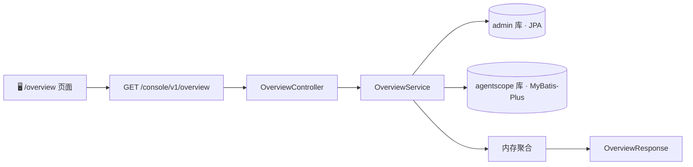

# Admin 总览页 — 技术方案

> 关联需求：`overview-page.md`

---

## 1. 一句话概要

新增 `GET /console/v1/overview` + 前端 `/overview` 路由，跨 admin + agentscope 双库聚合 6 项指标 + 4 个图表数据，内存聚合返回。

---

## 2. 涉及链路



| 层 | 节点 | 说明 |
|------|------|------|
| Frontend | `/overview` 页面 | 6 卡片 + 饼图 + 柱图 + Timeline + 进度条 |
| Controller | `OverviewController` | `GET /console/v1/overview` |
| Service | `OverviewService` | 双库查询 → 内存聚合 |
| DB | admin 库 (JPA) | prompt / prompt_version / experiment / dataset |
| DB | agentscope 库 (MyBatis-Plus) | knowledge_base / document / model_config |

---

## 3. 接口设计

| 项目 | 内容 |
|------|------|
| 方法 | `GET` |
| 路径 | `/console/v1/overview` |
| 鉴权 | `TokenAuthInterceptor`（`/console/v1/**` 已覆盖） |
| 返回 | `Result<OverviewResponse>` |

### 返回结构

```java
OverviewResponse {
    OverviewStats stats;                   // 6 个 StatItem
    Map<String,Integer> experimentStatus;  // DRAFT→5, RUNNING→2, ...
    List<TopPromptVersion> topPromptVersions;
    List<RecentActivity> recentActivities;
    List<DocIndexStatus> docIndexStatus;
}

StatItem { long total; }

TopPromptVersion { String promptKey; int preCount; int releaseCount; }

RecentActivity { String type; String title; long time; String description; }

DocIndexStatus { String kbId; String kbName; int totalDocs; int indexedDocs; double progress; }
```

---

## 4. 数据获取（方案 A：双库分查 + 内存聚合）

| 数据项 | SQL / 来源 | 库 |
|--------|-----------|-----|
| prompts.total | `SELECT COUNT(*) FROM prompt` | admin |
| versions.total | `SELECT COUNT(*) FROM prompt_version` | admin |
| experiments.total | `SELECT COUNT(*) FROM experiment` | admin |
| datasets.total | `SELECT COUNT(*) FROM dataset` | admin |
| knowledgeBases.total | `KnowledgeBaseMapper.selectCount(null)` | agentscope |
| models.total | `ModelConfigMapper.selectCount(null)` | agentscope |
| experimentStatus | `SELECT status, COUNT(*) FROM experiment GROUP BY status` | admin |
| topPromptVersions | `SELECT prompt_key, status, COUNT(*) FROM prompt_version GROUP BY prompt_key, status ORDER BY cnt DESC LIMIT 20` | admin |
| recentActivities | UNION `prompt_version`(prompt_key,version,create_time) + `experiment`(name,status,create_time) + `dataset`(name,create_time) ORDER BY create_time DESC LIMIT 20 | admin |
| docIndexStatus | `kb LEFT JOIN document GROUP BY kb.id`：`COUNT(doc.id) AS total`, `SUM(doc.status='indexed') AS indexed` | agentscope |

---

## 5. 前端方案

| 要素 | 实现 |
|------|------|
| 路由 | 新增 `/overview`，umi 约定式路由（`src/pages/Overview/index.tsx`） |
| 侧边栏入口 | `SideMenuLayout.tsx` 菜单数组追加 `{ path: '/overview', name: '总览', icon: DashboardOutlined }` |
| 指标卡 | antd `Card` + `Statistic`，6 列 `Row` + `Col span={4}` |
| 饼图 | antd `Progress` 环形模式（`type="circle"`），分段 legend 用纯 div + 色块 |
| 柱图 | 纯 CSS 柱状条：`div` + `height` 百分比 + 渐变背景，每个 promptKey 两根柱（pre 橘色 / release 绿色） |
| Timeline | antd `Timeline` 组件，左侧图标按 type 区分 |
| 进度条 | antd `Progress` 组件，`percent={indexedDocs/totalDocs*100}` |

> **不引入 echarts / @ant-design/charts / 任何图表库。** 全部用 antd 现有组件 + 纯 CSS 实现。

---

## 6. 改造步骤

| 步骤 | 做什么 | 预估 |
|------|--------|------|
| S1 | 新建 `OverviewResponse.java` DTO（含内嵌 5 个类） | 20 min |
| S2 | 新建 `OverviewService.java` + `OverviewServiceImpl.java` | 1h |
| S3 | 新建 `OverviewController.java` | 15 min |
| S4 | 新建 `src/pages/Overview/index.tsx` | 2h |
| S5 | `SideMenuLayout.tsx` 加菜单项 | 5 min |
| S6 | 前端开发完跑 `umi build` 验证无报错 | 5 min |

> **总预估 ~4h**。
