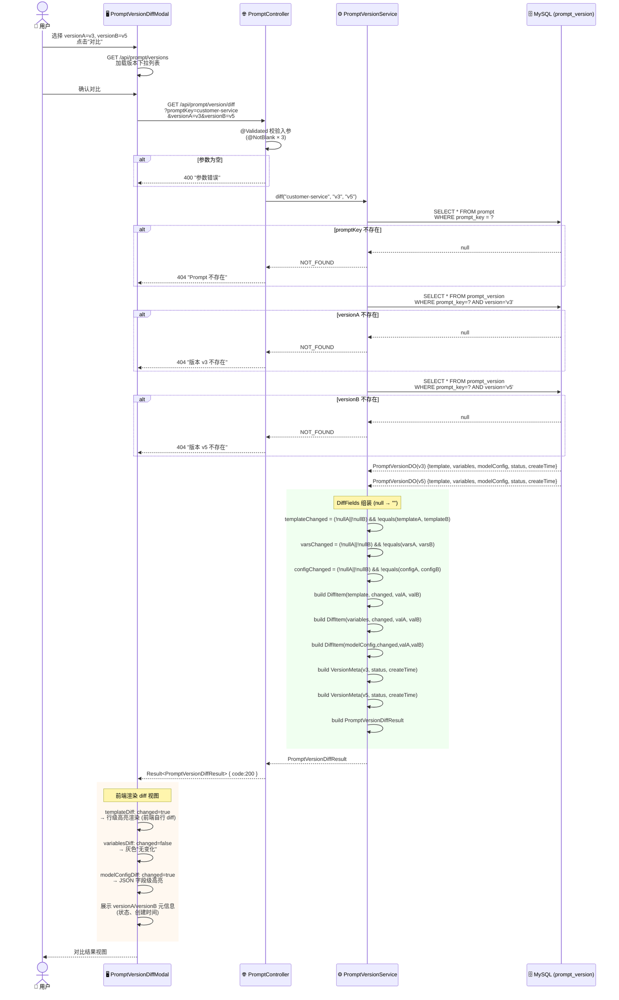
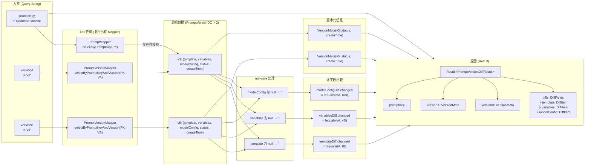
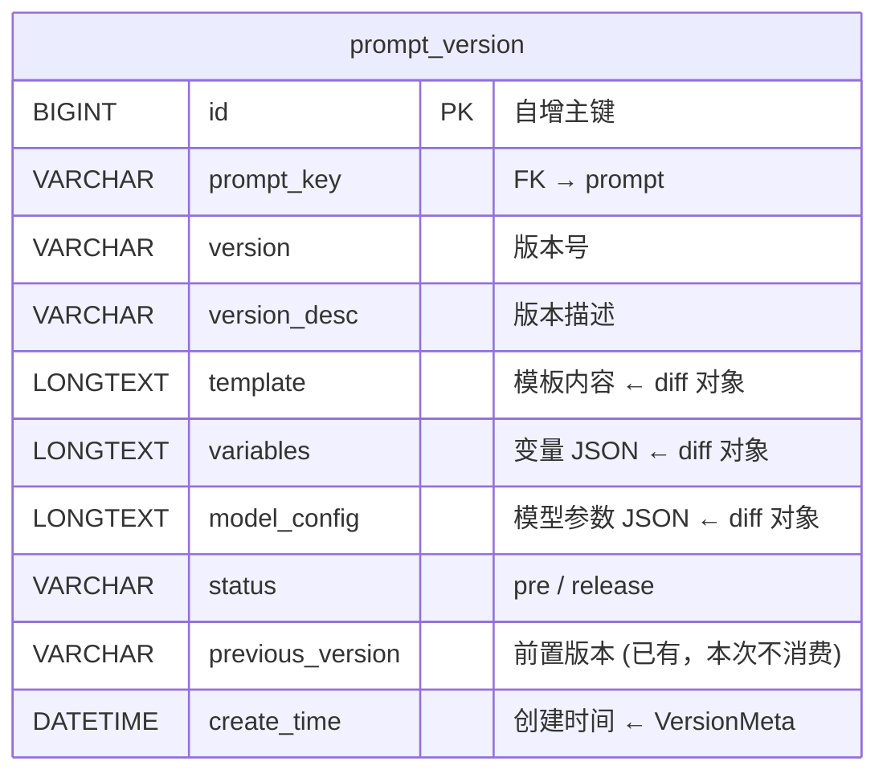

# Prompt 版本对比 — 改造流程图

> 对应改造点：`docs/requirements/prompt-version-diff-impact.md`
> 不改表结构

---

## 1. 完整调用链（时序图）

---

## 2. 数据流（入参 → DiffItem 转换）

---

## 3. 表结构：不改表

> 本需求**不涉及任何 DDL 变更**。
>
> `prompt_version` 表的 `previous_version` 字段（`VARCHAR(32)`，非空，默认 `''`）已在建表时预留，本次不做修改，也不通过后端逻辑消费该字段。`GET /api/prompt/version/diff` 的 `versionA`/`versionB` 由调用方显式传入，不从 `previous_version` 推断。

---

## 4. 与现有代码的接缝

| 接缝点 | 现有代码 | 本次改动 |
|--------|----------|----------|
| Controller 路由 | `PromptController` 已有 `GET /api/prompt/version` | 新增 `GET /api/prompt/version/diff`，同 Controller 加方法 |
| Service 接口 | `PromptVersionService` 已有 `getByPromptKeyAndVersion` | 新增 `diff()` 方法签名 |
| DAO 查询 | `PromptVersionMapper.selectByPromptKeyAndVersion` | **不改**：两次调用查出 versionA + versionB |
| DTO | `PromptVersionDetail` 已有 `template` / `variables` / `modelConfig` | 新建 `PromptVersionDiffResult`，不修改现有 DTO |
| 鉴权 | `Authorization: Bearer <token>` 统一拦截 | **不改**：`/api/**` 路径已受保护 |
