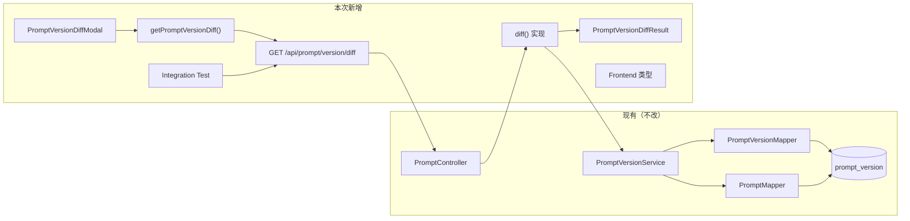
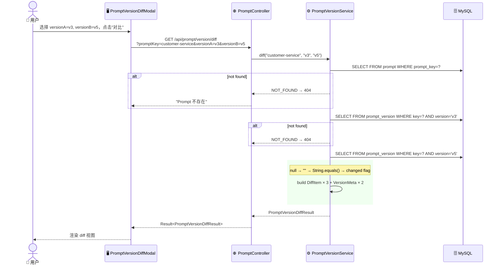
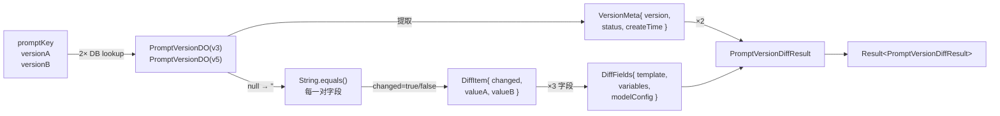

# Prompt 版本对比 — 改造方案（完整版）

> 整合自 `prompt-version-diff.md`（需求）· `prompt-version-diff-flow.md`（流程图）· `prompt-version-diff-impact.md`（影响分析 + 改造步骤）
> 状态：已审核 ✅
> 总预估：~5.5h

---

## 1. 一句话概要

新增 `GET /api/prompt/version/diff` 接口，支持团队多人协作场景下任意两个 Prompt 版本的内容（template / variables / modelConfig）与元信息（创建时间、状态）对比，用于演进追溯和发布前 review。后端返原始值 + `changed` 标志，前端做行级高亮渲染。

---

## 2. 涉及链路

### 链路图



### 节点详情

| 层 | 节点 | 类型 | 说明 |
|------|------|------|------|
| Controller | `GET /api/prompt/version/diff` | 🆕 新增 | 入参 promptKey + versionA + versionB，返回 `Result<PromptVersionDiffResult>` |
| Service | `PromptVersionService.diff()` | 🆕 新增方法 | 查两版本 → 逐字段 null-safe 比较 → 组装 DiffFields |
| DAO | `PromptVersionMapper.selectByPromptKeyAndVersion()` | — 复用 | 已有方法，无改动 |
| DAO | `PromptMapper.selectByPromptKey()` | — 复用 | Prompt 存在性校验 |
| DTO | `PromptVersionDiffResult` | 🆕 新增 | 4 层内嵌结构（顶层 → DiffFields → DiffItem / VersionMeta） |
| Frontend | `PromptVersionDiffModal.jsx` | 🆕 新增 | 版本选择器 + diff 展示 |
| Frontend | `getPromptVersionDiff()` | 🆕 新增 | API 调用函数 |
| Test | `PromptVersionDiffIntegrationTest` | 🆕 新增 | 黑盒 HTTP 集成测试 |

---

## 3. 改造点清单

### 后端

| 编号 | 类型 | 文件 | 改什么 | 状态 |
|------|------|------|--------|------|
| P01 | 新增 | `dto/PromptVersionDiffResult.java` | 新建 DTO，含内嵌 `DiffFields` + 独立 `VersionMeta`、`DiffItem` | ✅ 已实现 |
| P02 | 新增 | `dto/VersionMeta.java` | 新建：`{ version, status, createTime }` | ✅ 已实现 |
| P03 | 新增 | `dto/DiffItem.java` | 新建：`{ changed, valueA, valueB }` | ✅ 已实现 |
| P04 | 修改 | `service/PromptVersionService.java` ~L36 | 接口新增 `diffVersions(String promptKey, String versionA, String versionB)` | ✅ 已实现 |
| P05 | 修改 | `service/impl/PromptVersionServiceImpl.java` ~L157 | 实现 `diffVersions()`：参数校验 → `getByPromptKeyAndVersion`×2 → `nullToEmpty` → `Objects.equals` 比较 → 组装 | ✅ 已实现 |
| P06 | 修改 | `controller/PromptController.java` ~L121 | 新增 `@GetMapping("/prompt/version/diff")`，`@RequestParam @NotBlank` ×3 | ✅ 已实现 |
| **P13** | — | `builder/interceptor/InterceptorConfig.java` ~L43 | `TokenAuthInterceptor` 追加 `/api/prompt/**`（鉴权缺口，待后续 P13 单独改） | ⏳ 待实现 |

### 前端

| 编号 | 类型 | 文件 | 改什么 |
|------|------|------|--------|
| P09 | 修改 | `frontend/.../services/prompt/typing.ts` ~L239 | 新增 `DiffParams`、`DiffResult`、`VersionMeta`、`DiffFields`、`DiffItem` 类型 |
| P10 | 修改 | `frontend/.../services/prompt/index.ts` ~L103 | 新增 `getPromptVersionDiff()` |
| P11 | 新增 | `frontend/.../components/PromptVersionDiffModal.jsx` | 版本对比弹窗：双下拉选择器 → 确认 → 调 API；**选中 2 个版本后禁用其余 checkbox**（防止多选）；回调中加 loading 状态（`isLoading` → spinner）；三段 diff 展示（template 行级标注 + variables/modelConfig 并排） |
| P12 | 修改 | `frontend/.../pages/prompts/prompt-detail/prompt-detail.jsx` | "版本对比"按钮 → 打开 Modal |

### 测试

| 编号 | 类型 | 文件 | 改什么 | 状态 |
|------|------|------|--------|------|
| T01 | 新增 | `test/.../service/impl/PromptVersionServiceImplTest.java` | Characterization Test：锁 `getByPromptKeyAndVersion` 现有行为（3 场景） | ✅ 已实现 |
| T02 | 新增 | `test/.../service/impl/PromptVersionServiceDiffTest.java` | `diffVersions` 单元测试：E01/E02/E04 + happy path + 参数校验（6 场景） | ✅ 已实现 |
| P15 | 新增 | `test/.../controller/PromptVersionDiffIntegrationTest.java` | 黑盒集成测试：5 个场景（200 / 404 / 400） | ⏳ 待实现 |

### 文档

| 编号 | 类型 | 文件 | 改什么 | 状态 |
|------|------|------|--------|------|
| D01 | 修改 | `docs/api-list.md` | 新增 `GET /api/prompt/version/diff` → 已上线 | ✅ 已更新 |
| D02 | 修改 | `docs/data-model.md` | DTO 清单追加 3 个新 DTO | ✅ 已更新 |

---

### 已实现文件路径速查

```
spring-ai-alibaba-admin/spring-ai-alibaba-admin-server-start/src/main/java/com/alibaba/cloud/ai/studio/admin/
├── dto/
│   ├── PromptVersionDiffResult.java   (P01)
│   ├── VersionMeta.java              (P02)
│   └── DiffItem.java                  (P03)
├── service/
│   └── PromptVersionService.java      (P04)
├── service/impl/
│   └── PromptVersionServiceImpl.java  (P05)
└── controller/
    └── PromptController.java          (P06)

spring-ai-alibaba-admin/spring-ai-alibaba-admin-server-start/src/test/java/com/alibaba/cloud/ai/studio/admin/
└── service/impl/
    ├── PromptVersionServiceImplTest.java  (T01 - Characterization Test)
    └── PromptVersionServiceDiffTest.java  (T02 - Unit Test)
```
|------|------|------|--------|
| P17 | 修改 | `docs/api-list.md` ~L125 | 新增 `GET /api/prompt/version/diff` 一行 |

---

## 4. 改造流程图

### 调用链时序



### 数据流



> **不改表结构。** `prompt_version` 所有字段不变，`previous_version` 已预留但不消费。

---

## 5. 影响范围与风险

| # | 维度 | 风险 | 受影响的接口/调用方 | 说明 |
|---|------|------|---------------------|------|
| 1 | 现有接口 | 🟢 低 | 无 | 新端点不冲突，纯增量 |
| 2 | 现有调用链 | 🟢 低 | `ExperimentServiceImpl.getByPromptKeyAndVersion()` — 不变 | `PromptVersionService` 增量加方法 |
| 3 | 测试 | 🟢 低 | 无 | Prompt 模块此前无自动化测试 |
| 4 | 文档 | 🟢 低 | `docs/api-list.md` | 加一行端点说明 |
| 5 | 前端兼容 | 🟢 低 | 无 | 零新依赖，纯增量组件 |
| 6 | 性能 | 🟡 中 | 新接口本身 | LONGTEXT 大字段网络传输；建议 `server.compression.mime-types` 覆盖 `application/json` |
| 7 | 数据库 | 🟢 低 | `prompt_version` | 无 DDL，纯只读查询 |
| 8 | 鉴权 | 🟡 中 | `InterceptorConfig.java` — 追加 `/api/prompt/**` 到 `TokenAuthInterceptor` | P13：当前 `/api/prompt/*` 不在任何拦截器范围内（`/api/v1/**` 由 ApiKey 拦截，`/console/v1/**` 由 Token 拦截），新增 `/api/prompt/**` 到 Token 拦截器以确保 diff 接口需登录 |

---

## 6. 改造步骤与顺序

### 依赖图

```
S1 (DTO)
 ├──▶ S2 (Service接口) ──▶ S3 (Service实现) ──▶ S4 (Controller) ──┬──▶ S7 (测试)
 │                                                                  │
 │                                                    S11 (鉴权) ◀──┘
 │
 └──▶ S5 (前端类型) ──▶ S6 (前端API) ──▶ S8 (Modal) ──▶ S9 (按钮入口)
                                                                   │
S10 (文档) ◀───────────────────────────────────────────────────────┘
```

### 步骤详表

| 步骤 | 改造点 | 做什么 | 前置 | 预估 |
|------|--------|--------|------|------|
| S1 | P01 | 新建 `PromptVersionDiffResult.java`，含 4 个内嵌 POJO | 无 | 20 min |
| S2 | P02 | `PromptVersionService` 接口新增 `diff()` 签名 | S1 | 5 min |
| S3 | P03 | `PromptVersionServiceImpl` 实现 `diff()`：查两版本 → null-safe 比较 → 组装 | S2 | 45 min |
| S4 | P04 | `PromptController` 新增 `@GetMapping("/prompt/version/diff")` | S3 | 15 min |
| S5 | P09 | `typing.ts` 新增 `DiffParams` / `DiffResult` 等类型 | 无 | 15 min |
| S6 | P10 | `services/prompt/index.ts` 新增 `getPromptVersionDiff()` | S5 | 10 min |
| S7 | P15 | 新建集成测试（黑盒）：5 个场景 | S4 + 后端运行 | 45 min |
| S8 | P11 | 新建 `PromptVersionDiffModal.jsx`：双下拉选择器（默认 A=latest release, B=latest pre）；**选中 2 个版本后禁用其余 checkbox**；确认后调 API，回调加 **loading spinner**（`isLoading` 状态控制）；结果分三段展示（template 行级 diff + variables/modelConfig 并排） | S5, S6 | 2h |
| S9 | P12 | `prompt-detail.jsx` 版本列表工具栏加"版本对比"按钮 | S8 | 15 min |
| S10 | P17 | `docs/api-list.md` 加一行 | 无 | 5 min |
| S11 | P13 | `InterceptorConfig.java` 的 `TokenAuthInterceptor` 追加 `.addPathPatterns("/api/prompt/**")`；无需额外 exclude（`/api/prompt/run` 入参含 API Key 时走业务鉴权）。验证：未登录调 diff → 401/403 | S4 | 10 min |

> **总预估 ~5.5h**。S1/S5 可并行启动；S4 后就绪即可跑 S7 测试和 S11 鉴权。

### 依赖决策点

| 决策 | 位置 | 方案 | 状态 |
|------|------|------|------|
| null 字段处理 | S3 | null 视同空字符串 `""`，`changed` 基于空串比较 | ✅ 已定 |
| JSON `changed` 判定 | S3 | `String.equals()`（不用结构比较） | ✅ 已定 |
| 集成测试风格 | S7 | 黑盒 HTTP，对运行中后端发请求 | ✅ 已定 |
| 前端 diff 实现 | S8 | 原生 `split('\n')` + CSS class，不引三方库 | ✅ 已定 |
| Modal loading 状态 | S8 | 加 `isLoading` + spinner，API 调用中展示 | ✅ 已定 |
| 监控 | — | 新接口接入已有 Actuator metrics（`/actuator/metrics/http.server.requests`），不加自定义指标 | ✅ 已定 |

---

## 7. 已审核的关键决策点

> 以下 4 个决策点已经审核，均为最终决定。实现时直接按此执行，无需再次确认。

---

### D1 — null 字段处理（最终决定）

**决定**：null 视同空字符串 `""`。

**做法**：Service 层 `diff()` 实现中，读出的 `PromptVersionDO` 的 `template` / `variables` / `modelConfig` 任一为 null 时，`DiffItem.valueA` / `valueB` 返回 `""`；`changed` 基于 `""` 与另一方比较。

**理由**：DB 中历史数据可能存在 null 字段；前端渲染空字符串比渲染 `null` 更简单；与需求文档 E04 一致。

---

### D2 — 集成测试风格（最终决定）

**决定**：黑盒 HTTP 测试。`PromptVersionDiffIntegrationTest` 对运行中 `localhost:8080` 直接发 HTTP 请求，校验响应码和 JSON 结构。

**做法**：参照 `AuthIntegrationTest` 风格：`RestTemplate` + `ObjectMapper`，`@BeforeAll` 检查后端可达。不依赖 `@SpringBootTest`。

**理由**：与 B2 批次测试风格一致、已验证可用、避免 `@SpringBootTest` 在 Windows 上的 MySQL 连接问题。

---

### D3 — 前端 Modal 交互细节（最终决定）

**决定**：加 loading 状态。选中 2 个版本后禁用其余 checkbox。

**做法**：
1. **版本选择器**：从 `GET /api/prompt/versions` 加载列表渲染 checkbox；监听已选数量，`selected.length === 2` 时将其余 checkbox `disabled=true`；取消勾选恢复
2. **Loading**：`useState(false)` → 确认按钮 `onClick` 设 `true` → API 返回后设 `false`；loading 期间展示 `<Spin />` 替代 diff 区域
3. **行级 diff**：`split('\n')` 后逐行 `===` 比较，CSS class 标注。不引入三方 diff 库

---

### D4 — 监控接入（最终决定）

**决定**：不新增自定义指标。新接口自动纳入 Spring Boot Actuator 已有指标。

**做法**：`/actuator/metrics/http.server.requests` 已按 `uri` tag 统计所有 Controller 端点耗时与调用量。新增 `GET /api/prompt/version/diff` 后自动出现在该指标中，无需额外代码。

**如需自定义指标**（下期考虑）：
- `timer`: diff 查询耗时分布（P50/P95/P99）
- `counter`: diff 调用量（区分 `changed=true` vs `changed=false`）

---

### D5 — 范围确认（最终决定）

| 候选 | 决定 | 最终状态 |
|------|------|---------|
| 后端行级 diff（unified diff） | 不做 | ✂️ 砍掉 |
| 跨 promptKey 对比 | 不做 | ✂️ 砍掉 |
| 3+ 版本多向对比 | 不做 | ✂️ 砍掉 |
| diff 结果 Redis 缓存 | 不做 | ✂️ 砍掉 |
| versionDescription 的 diff | 不做 | ✂️ 砍掉 |
| 细粒度权限 | 不做 | ✂️ 砍掉 |
| diff 导出（PDF/Markdown） | 下期 | ⏳ |
| 一键比对上一版 | 下期 | ⏳ |

---

## 附录：文件路径速查

| 层 | 路径前缀 |
|------|----------|
| 后端根 | `spring-ai-alibaba-admin/spring-ai-alibaba-admin-server-start/src/main/java/com/alibaba/cloud/ai/studio/admin/` |
| DTO | `dto/` |
| Service | `service/` → `service/impl/` |
| Controller | `controller/` |
| DAO | `mapper/` |
| 前端根 | `spring-ai-alibaba-admin/frontend/packages/main/src/legacy/` |
| 前端 API | `services/prompt/` |
| 前端组件 | `components/` |
| 前端页面 | `pages/prompts/` |
| 测试根 | `spring-ai-alibaba-admin/spring-ai-alibaba-admin-server-start/src/test/java/com/alibaba/cloud/ai/studio/admin/controller/` |
| 文档 | `docs/` |
